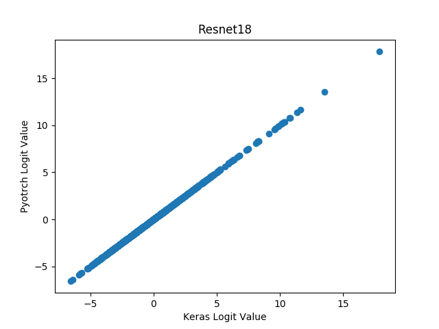
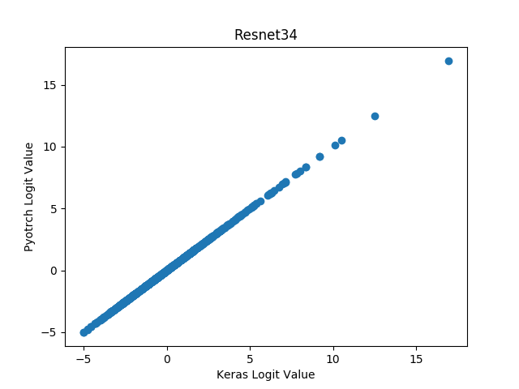
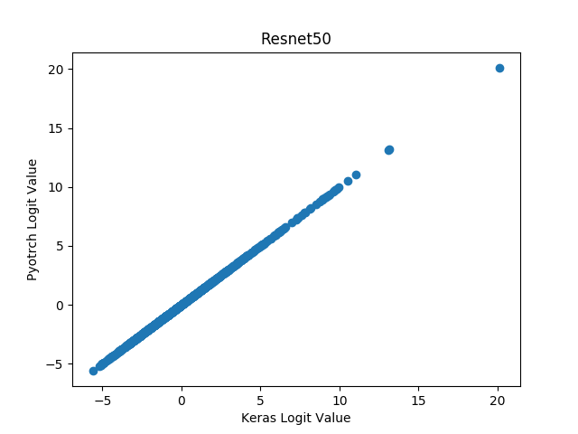
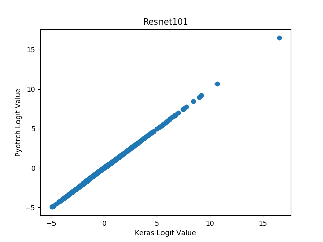
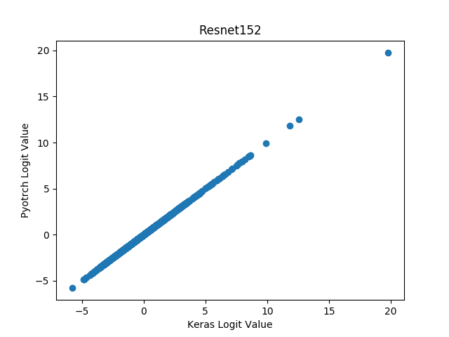

# keras-torchvision

Convert the pretrained resnet models from Pytorch's torchvision module for use in Keras with the Tensorflow backend (resnet18, resnet34, resnet50, resnet101, resnet152)

Divided into two scripts, using numpy files as an interchange medium. This makes it possible to have Pytorch and Tensorflow in two different environments.

Converts with anal attention to detail, matching activations at each layer. Picky about how 'same' padding is implemented.

`torchvision_resnet.py` implemented to read very similarly to `pytorch/vision/torchvision/models/resnet.py`

Usage:

```
python resnet_pytorch_to_numy.py 18
python resnet_numpy_to_keras.py 18

python
import keras
keras.load_model('resnet18.h5')
```

Validation:









Tested:
- Kears 2.1.2
- Tensorflow 1.4.1
- Pytorch 0.2.0_3
- Cuda 7.5
